# 1. Neural Networks
<!-- TOC -->

- [1. Neural Networks](#1-neural-networks)
  - [1.1. Why we need Machine Learning (Neural Nework)?](#11-why-we-need-machine-learning-neural-nework)
  - [1.2. What is Learning](#12-what-is-learning)
  - [1.3. How ML used in NLP?](#13-how-ml-used-in-nlp)
  - [1.4. Perceptron](#14-perceptron)
  - [1.5. Gradient Descent](#15-gradient-descent)
- [2. Classification](#2-classification)
  - [2.1. Definition of Classification](#21-definition-of-classification)
  - [2.2. What does the Classifier Fucntion do?](#22-what-does-the-classifier-fucntion-do)
  - [2.3. Lineary Separable](#23-lineary-separable)
- [3. Linear Models for Classification](#3-linear-models-for-classification)
  - [3.1. Geomentry of the Linear Discrimminant Function](#31-geomentry-of-the-linear-discrimminant-function)
  - [3.2. Decision Boundary](#32-decision-boundary)
    - [3.2.1. D-Decision Boundary for OR Gate](#321-d-decision-boundary-for-or-gate)
    - [3.2.2. D-Decision Boundary for AND Gate](#322-d-decision-boundary-for-and-gate)
    - [3.2.3. Decision Boundary for Sentiments - NLP](#323-decision-boundary-for-sentiments---nlp)
    - [3.2.4. Decision Boundary - Variation of $$W_J$$](#324-decision-boundary---variation-of-wj)
    - [3.2.5. Decision Boundary - Variation of Bias](#325-decision-boundary---variation-of-bias)
    - [3.2.6. Decision Boundary and Gradient Descent](#326-decision-boundary-and-gradient-descent)
  - [3.3. Exercise - Lineary Separable](#33-exercise---lineary-separable)
- [4. Biological Neural Network](#4-biological-neural-network)
  - [4.1. Biological Neuron](#41-biological-neuron)
- [5. Perceptron](#5-perceptron)
  - [5.1. Laws of Association w.r.to NLP in Neural Network](#51-laws-of-association-wrto-nlp-in-neural-network)
  - [5.2. Neuron vs Perceptron](#52-neuron-vs-perceptron)
  - [5.3. High-level view of Perceptron](#53-high-level-view-of-perceptron)
  - [5.4. Perceptron Learning](#54-perceptron-learning)
    - [5.4.1. Exercise - 1](#541-exercise---1)
    - [5.4.2. Exercise - 2](#542-exercise---2)
  - [5.5. Algorithm for Perceptron Learning](#55-algorithm-for-perceptron-learning)
    - [5.5.1. Exercise](#551-exercise)
  - [5.6. What can be done with Perceptron?](#56-what-can-be-done-with-perceptron)
  - [5.7. Example - How Perceptron behaves](#57-example---how-perceptron-behaves)
    - [5.7.1. Logical AND](#571-logical-and)
    - [5.7.2. Logical OR](#572-logical-or)
  - [5.8. Sentiment Analysis - Using Perceptron](#58-sentiment-analysis---using-perceptron)
    - [5.8.1. Generate Training Data](#581-generate-training-data)
    - [5.8.2. Build Model](#582-build-model)
    - [5.8.3. Predict Sentiments](#583-predict-sentiments)
  - [5.9. Perceptron Learning through EPOCH count](#59-perceptron-learning-through-epoch-count)
  - [5.10. Perceptron Limitations](#510-perceptron-limitations)
- [6. Activation Functions](#6-activation-functions)
- [7. Logical XOR](#7-logical-xor)
  - [7.1. Intuition](#71-intuition)
  - [7.2. Exercise - 1](#72-exercise---1)
  - [7.3. Exercise - 2](#73-exercise---2)

<!-- /TOC -->
- From NLP Perspective
  - Another mechanism to process the corpus and get insights out of them

## 1.1. Why we need Machine Learning (Neural Nework)?

- In order to understand the need of NN, we need to understand the limitations of standard algorithms
  - __*Standard Algorithm*__: An algorithm is a sequence of instructions to solve a problem
    - The steps to solve problems are well defined
      - We know _what are the inputs_
      - We _know what are the rules to manipulate the input_, and
      - We _know what we expect out of program as output_
    - Steps are coded in some ordered sequence to transform the input from one form to another
    - Rules are unambiguous
      - Without specifying rules, we can't solve any problem in _algorithmic fashion_
    - Sufficient Knowledge is available to fully solve the problem
      - We need to know about the Domain to solve the problem
- There are problems whose solutions cannot be formulated using standard rule-based algorithms
- Problems that require subtle inputs cannot be solved using standard algorithmic approach - Face Recognition, Speech Recognition, Hand-written character recognition, etc
- Finding Examples and using experience gained in similar situations are useful
- Examples provide certain underlying patterns
- Patterns give the ability to predict some outcome or help in constructing an approximate model
- __Learning__ is the key to the ambiguous world

## 1.2. What is Learning

- Given the input and output, finding the relationship between Input and Output
  - This learned one is called model
  - So that, we can give input similar to the one given as example in learning and get the output
- There are problems, where we can't clearly give exact details of input and the rules to find the output.
  - In such case, we want the __*Machine*__ to __*Learn*__ from the given input (examples), to find (estimate) the Output
- The system starts looking at the (latent) patterns found in the examples, using which it predicts/estimates the outcome
- Always their will be new data, so _learning_ is a continuous process and model should be updated accordingly

## 1.3. How ML used in NLP?

- Classification
- Word Embedding
- Learning a Sentence (This is not possible with Probabilistic Language Model)
- (How to) Encode a Paragraph
- (How to) Encode a Problem Statement
- Translation from language to the other
  - Can be done with Statistical Machine Translation models, but NN based models have advatange
- Modeling conversations - Chatbot

## 1.4. Perceptron

- From [17]
  - Perceptron is the basic element of Neural Network
  - From where Neural Network started

## 1.5. Gradient Descent

- Helps in answering
  - How do we iterate to realy get to the solution by descending down /ascending up the slope using Gradient Descendent

# 2. Classification

- From [v1] Week 3, Lec 2
  - __Classification__ is the task of assigning predefine dis-joint categories to objects
  - Example
    - Detect $$\text{Spam emails}$$
    - <script type="math/tex">\text{Spam emails}</script>
    - Find the set of $$\text{mobile phones < Rs.10000 and received  $$5*$$ reviews}$$
      - In these kind of classification NER will be used to extract the features and then classification will be performed over the extracted features
    - Identify the category of the incoming document as Sports, Politics, Entertainment or Business
    - Determine whether a movie review is a Positive of Negative Review

## 2.1. Definition of Classification

- The input is a collection of records
- Each rechord is represented by a tuple ($$x$$,$y$$)
- $$x=x_1,x_2,...,x_n$$ and $$y=y_1,y_2,...y_n$$ are the input features and the classes respectively
- Example
  - $$x \in R^{2}$$ is a vector - the of observed variables
  - ($$x$$,$y$$) are related by an unknown function. The goal is to estimate the unknown function $$g(.)$$ also known as a classifier function, such that $$g(x) = f(x), \forall x$$
  
  

## 2.2. What does the Classifier Fucntion do?

- Assuming we have a linearly separable $$x$$, the classifier function $$g(.)$$ implements decision rule
  - Fitting a Straight Line to a given data set requires two parameters $$(w_0 $$ $$and$$  $$w)$$
    - $$w_0$$ is the bias
      - It is the distance of the line from the origin
    - $$w$$ is the weight
      - It is the orientation of the line
    - Both $$w_0$$ and $$w$$ are called as _Model Parameters_
    - __*Fitting the Line*__: This decision doubary line is estimated in a iterative fashion
      - Using the errors that we are caulcualted after fitting a line in each iteration
      - This fitment is leart during the above iterative process
  - The decision rule divides the data space into two sub-spaces separating two classes using a boundary
  - The distance of the boundary from the origin $$= \frac{w_0}{\parallel w \parallel}$$
  - Distance of any point from the boundary $$=d=\frac{g(x)}{\parallel w \parallel}$$
  
  

## 2.3. Lineary Separable

- From https://en.wikipedia.org/wiki/Linear_separability
  - If a set of points can be separated by using a line (a hyperplane in higher dimension), then we can say that the points are __*lineary separable*__

# 3. Linear Models for Classification

- The goal of classification is to take a vector $$x$$ and assign it to one of the $$N$$ discrete $$\mathbb{C}_n$$, where $$n=1,2,3,...,N$$
  - The classes are disjoint and an input is assigned to only one class
  - The input space is divided into _decision regions_
  - The boundaries are called a _decision boundaries or decision surfaces_
  - In general, if the input space is $$N$$ dimensional, then $$g(x)$$ would define $$N-1$$ hyperplane

## 3.1. Geomentry of the Linear Discrimminant Function

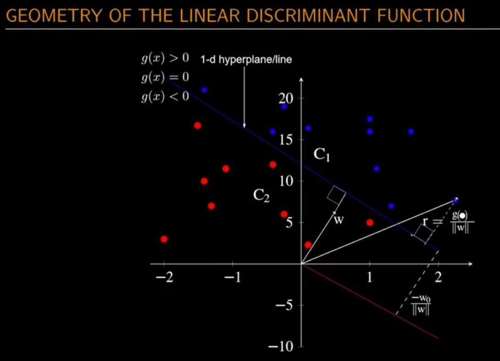

## 3.2. Decision Boundary

### 3.2.1. D-Decision Boundary for OR Gate

- The decision regions are separated by a hyperplane and it is defined by $$g(x) - 0$$.
- This separates linearly separable classes $$\mathbb{C}_1$$ and $$\mathbb{C}_2$$
- The $$OR$$ Gate _Truth Table_

| $$x_1$$ | $$x_2$$ | y |
|-------|-------|---|
| 0     | 0     | 0 |
| 0     | 1     | 1 |
| 1     | 0     | 1 |
| 1     | 1     | 1 |

- If any of the input feature $$x_1$$ or $$x_2$$ has 1, then result is $$1$$
- Below diagram depicts the boundary line for this OR gate
  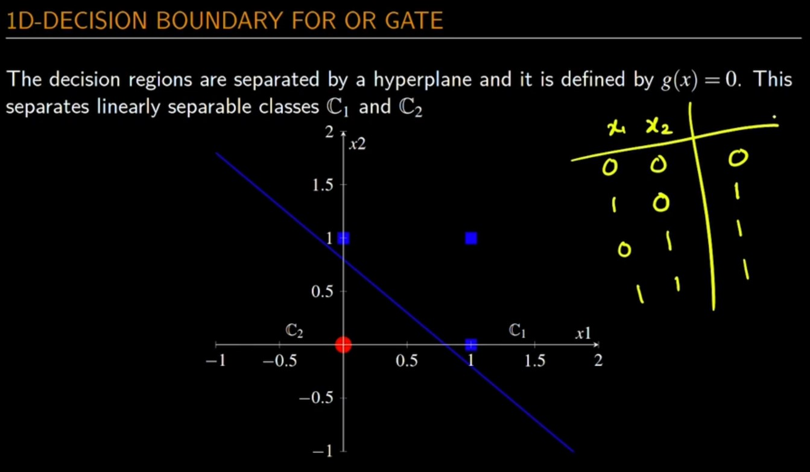

### 3.2.2. D-Decision Boundary for AND Gate

- The decision regions are separated by a hyperplane and it is defined by $$g(x) = 0$$.
- This separates linearly separable classes $$\mathbb{C}_1$$ and $$\mathbb{C}_2$$
- The $$AND$$ Gate _Truth Table_

| $$x_1$$ | $$x_2$$ | y |
|-------|-------|---|
| 0     | 0     | 0 |
| 0     | 1     | 0 |
| 1     | 0     | 0 |
| 1     | 1     | 1 |

- We will have 1 only when both $$x_1$$ and $$x_2$$ are 1
- The boundary line for this $$AND$$ gate will similar to the one below

  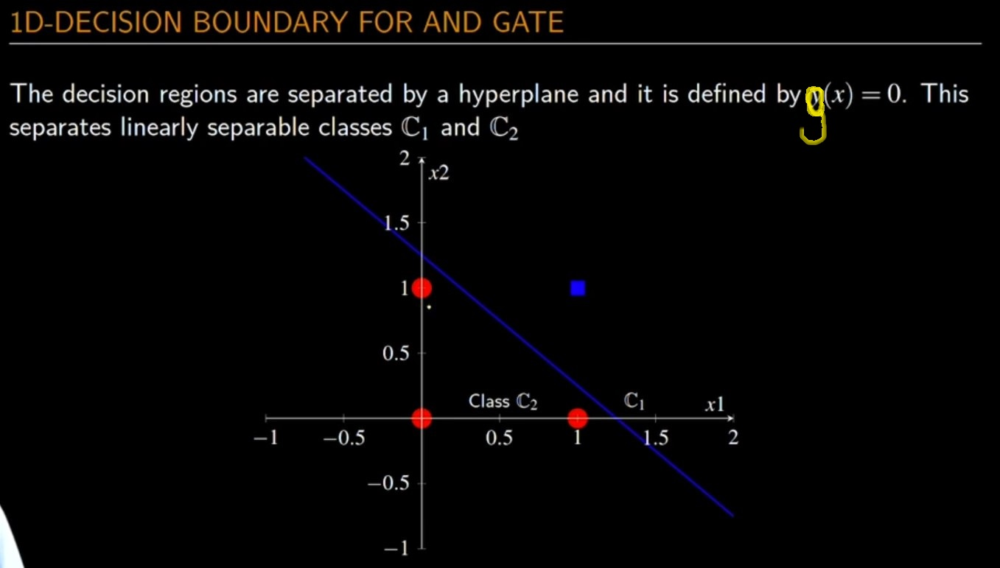

### 3.2.3. Decision Boundary for Sentiments - NLP

- The concept of decision boundary can be applied to NLP as well
- Let us consider some positive and negative sentiment terms which are contained in two classes $$\mathbb{C}_P$$ and $$\mathbb{C}_N$$
  - $$\mathbb{C}_P = [\text{achieve efficient improve profitable}] = +1$$
  - $$\mathbb{C}_N = [\text{termination penalties misconduct serious}] = -1$$
  
  
  
- __*Note*__
  - Here inputs are texts
  - We need to transform the input for finding the decision boundary

### 3.2.4. Decision Boundary - Variation of $$W_J$$

- The slope (weight) of the line is decided by varaition sof $$W_J$$
  - During fitment of a line/ learning the model, the slope of the line need to be adjusted to have _line of fit_
  - So, $$W_J$$ need to be adjustedbased on the errors calcualted after each iteration during fitment

  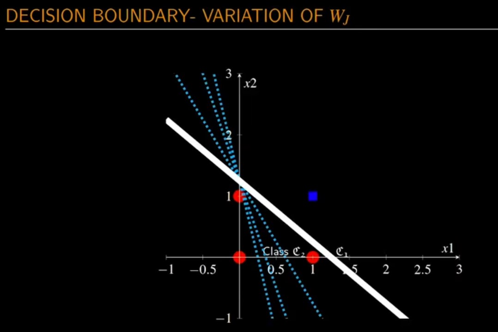

### 3.2.5. Decision Boundary - Variation of Bias

- The distance of the decision boundary from origin is decided by bias ($$w_0$$)
  - During fitment, line/hyperplane need to be moved to have apprximate decision boundary which splits the input to decision regions
  - So, bias $$w_0$$ also need to be variated during iterative process of learning/fitment
- The contribution of bias to the creation of the decision boundary

  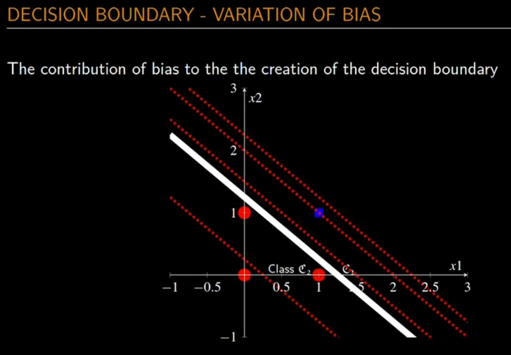

### 3.2.6. Decision Boundary and Gradient Descent

- Example showing the iterative process of fitting the line using _Gradient Descent_
  - Assume we have the following
    - Input: 10 points are taken as input, shown in picture as $$\perp$$
    - Output: Assume output classes are well defined and well known
  - What we don't know is how to fit the line so that decision region(s) are created to each class
    - This fitment has to be learnt during the iterative process
- Picture shows the fitment of line in 10 iterations
  - Let $$y$$ be our target
    - The green line which goes over $$\perp$$ in the left diagram
  - let $$\hat{y}$$ is estimate
    - The first line is shown in blue color (parallel to x-axis)
  - Goal is to have $$y-\hat{y} \approx 0$$
    - That is the error should reach the _minima_, or no more change that can be brought to the model parameters, then we can stop the iteration
  - In each iteration error $$y-\hat{y}$$ is calcualted and it is propogated back to the model and ask the model to learn the parameter ($$w$$ and $$w_0$$ keeps changing in each iteration)
  
Image 1             |  Image 2
:-------------------------:|:-------------------------:
  |  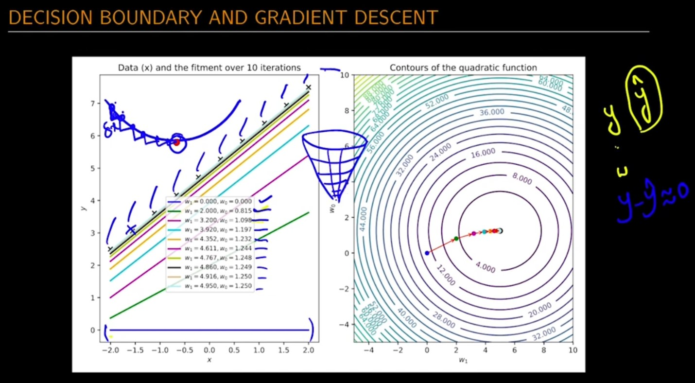

## 3.3. Exercise - Lineary Separable

- Is below data libearyly separable?

  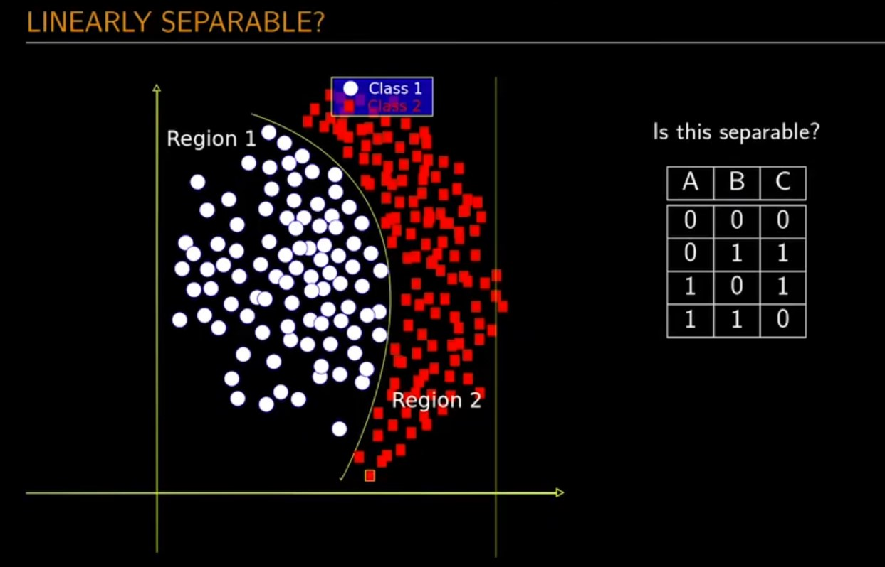

# 4. Biological Neural Network

- Classification is possible when points are __*linearly seperable*__ using linear models
  - Using _Decision Surfaces_ where the points are _lineary separable_
- Similarly we can do classification (linear separation) using __*Perceptron*__

## 4.1. Biological Neuron


- __*Dendrite(s)*__ provides the _input(s)_
- __*Synapse*__ are the incoming _signals_
- __*Axon*__ is the _output_ function
  - Which carries the electro-chemical signal to other neurons
  - i.e., electrical signals are carried from one neuron to another neuron using axon's

# 5. Perceptron

- Artial Neuron is called as __*Perceptron*__

## 5.1. Laws of Association w.r.to NLP in Neural Network

- Associative laws are useful in design of Neural Network
  - For __*Learning and Memory*__
  - These laws are patterns that can be used as input to the model
  - So, we should be able to capture these properties in the text
- __Law of Similarity__
  - Example: 
  - In LSI
    - From given word, find similar words of the given word (LSI)
    - Patterns are found using this _Laws of Similarity_
  - In word2vec
    - Given a set of context and given the surronding words, find the middle word (word2vec)
- __Law of Contrast__
  - Finding antonyms (opposite) of words from the given word
- __Law of Contiguity__
  - Things that link together w.r.to time / space
- __Law of Frequency__
  - Words that are connected through the context

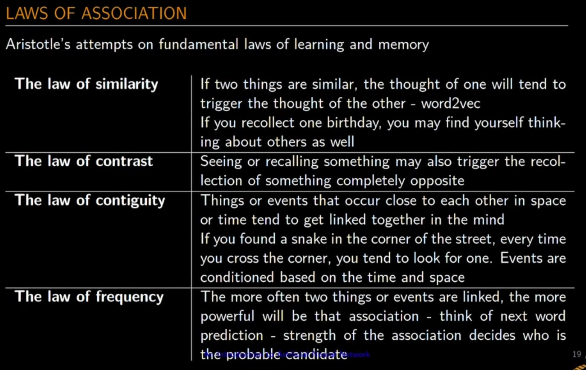

## 5.2. Neuron vs Perceptron

|                        Neuron                        |                          Perceptron                          |
|:----------------------------------------------------:|:------------------------------------------------------------:|
| Biological                                           | A mathematical model of a biological neuron                  |
| Dendrites receive electrical signals                 | Perceptron receives mathematical values as input             |
| Electro-chemical signals between Dentrites and Axons | The weighted sum represents the total strength of the signal |
| The electro-chemical signals are not static          | Weights change during the training process                   |

## 5.3. High-level view of Perceptron

- An example perceptron having only one element to linearly classify set of vectors to two regions
- $$x_1, x_2, ..., x_n$$ are called _inputs_ or _feature vectors_, connected to the perceptron using weights $$w_1, w_2, ..., w_n$$
  - The input could be
  - Any real values
  - Or a Ont-Hot Encoded Vectors in case of NLP
- $$+1$$ is the bias, connected to the preceptron using weight $$w_0$$
- $$\hat{y}$$ is the output is going to be two values
  - $$\{-1,+1\}$$ depending on value of activation function
- For the sake of explanation, perceptron is shown as _Activation Function_ and _Decision Function_
  - Activation Function
  - Once the values are received, they are linearly sum'ed
  - We will have value, for example between $$[-5,+5]$$ depending on the weights that are connecting the neuron
  - Activation Function value need to translated into a real value range $$[0,1]$$ or $$[-1,+1]$$ or using some probability distribution, where sum of all values equal 1 $$\sum [0..1] = 1$$
  - What Activation fundion does is, it smashes/squashes the calculated neuron value into new space $$[0,1]$$
  - Decision Function
  - Translates the _Activation Function_ value into two different values using some __*threshold*__

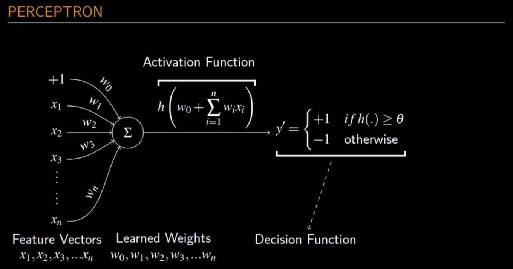

## 5.4. Perceptron Learning

- How do we teach perceptron or how does percetron learn the weights?

- Perceptron learns the weights
  - Weights are the model parameters.
  - So, it needs to learn the weigths
- They are adjsuted until the output is consistent with the target output in the training examples
- Let $$k$$ be the number of iterations went through in perceptron learning process so far
  - So we will have $$w^1, w^2, ..., w^k$$ weights learned in each iteration
- $$w^{k+1} \propto (y - \hat{y})$$
  - The new weight $$w^{k+1}$$ is proportional to the errors $$(y - \hat{y})$$ that were computed
  - $$y$$ is actual target of the training data
  - $$\hat{y}$$ is the estimated output
- The weights are updated as below
  - $$w^{k+1}_j = w^{(k)}_j - \eta(y_i - \hat{y}^{(k)})x_{ij}$$
  - where
    - $$w^{(k)}$$ is the weight parameter associated with the $$i^{th}$$ input at $$k^{th}$$ iteration
    - $$\eta$$ is the learning parameter
    - It is the step size, helping in how to descent, to find target output
      - If $$\eta$$ value is very high, the learning jumps
      - If $$\eta$$ value is very small, it slowly and steadly reaches the target output
      - This $$\eta$$ value will be decided/adjusted based on
      - Input features
      - Training samples
      - How weights are adjusted in each iteration
      - How the errors are jumped from one point to the other in each iteration
      - This $$\eta$$ parameter is updated based on the experienced that we gain on model estimation
    - Normally it ranges from $$[0.1, 0.01]$$
    - $$x_{ij}$$ is the $$j^{th}$$ attribute of the $$i^{th}$$ training sample
  - The new weight $$w^{k+1}_j$$ is given by old weight $$w^{(k)}_j$$, learning parameter $$\eta$$, the error $$(y - \hat{y})$$ and the input parameter $$x_{ij}$$
- If $$(y - \hat{y}) \approx 0$$, no prediction error
  - Normmaly it will be set to $$1.e-5$$
- During the training the weights contributing most to the error require adjustments

### 5.4.1. Exercise - 1

- Lets suppose
  - Target output is
  - $$y = 1$$
  - The Estimated output is
  - $$\hat{y} = -1$$
- How will you update $$w$$?
- What kind of adjustment you will make to $$w$$ so that $$\hat{y}$$ becomes closer to $$y$$?

- Refer some books and figure out what could the adjsutments that we can make?
  - Hint: $$w^{k+1} \propto (y - \hat{y})$$

### 5.4.2. Exercise - 2

- Same of Exercise 3, but
  - $$y = -1$$
  - $$\hat{y} = 1$$
- In which way you would adjust the weights?
  - Either you will increase the weight or you will decrease the weight?

## 5.5. Algorithm for Perceptron Learning

1. Total number of input vectors = $$k$$
2. Total number of features = $$n$$ (for each vector)
3. Learning parameter $$\eta = 0.001$$, where $$0 < \eta < 1$$
4. $$epoch^1$$ count $$t = 1$$, $$j = 1$$
5. Initialize weights $$w_i$$ with random numbers
6. Initialize the input layer with $$\vec{x_j}$$
7. Calculate the output using $$\sum w_i x_i + w_0$$
8. Calculate the error $$(y- \hat{y})$$
9. Update the weights $$w_j(t + 1) = w_j - \eta(y-\hat{y})x_j$$
10. Repeat steps 7 to 9 until: the error is less than $$\theta$$ (the given threshold) or a predetermined number of $$epochs$$ have been compled

$$^1$An epoch is one complete presentation of the data set to be learned to a learning machine


### 5.5.1. Exercise

- From Algorithm for Perceptron Learning
  - To provide a stable weight update for this step, $$w_j(t + 1) = w_j - \eta(y-\hat{y})x_j$$, we require a small $$\eta$$. This results in slow learning. Bigger $$\eta$$ would be good for fast learning.
  - What are the problems?
  - What is the compromise?

## 5.6. What can be done with Perceptron?

- You will be able to classify objects that are in linear space
  - It is __*mandatory*__, that the objects that we are going to classify should be __*linearly separable*__ 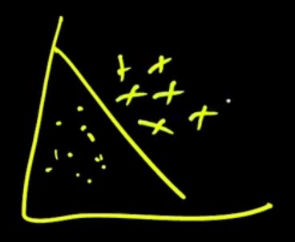
- Perceptron will contain __*only one neuron*__, even though we have $$n$$ number of neurons in input layer
  - Input layer neurons just pass on the value to the perceptron
  - The computation will happen only in Perceptron

## 5.7. Example - How Perceptron behaves

### 5.7.1. Logical AND

- Here for demonstration purpose, below values has been set to:
  - $$b = -1, w_0 = -1$$
  - $$w_1 = +1$$ for $$x_1$$
  - $$w_2 = +1$$ for $$x_2$$
- With above learnt model parameters, it is evident that Perceptron able to classify the linearly separable objects

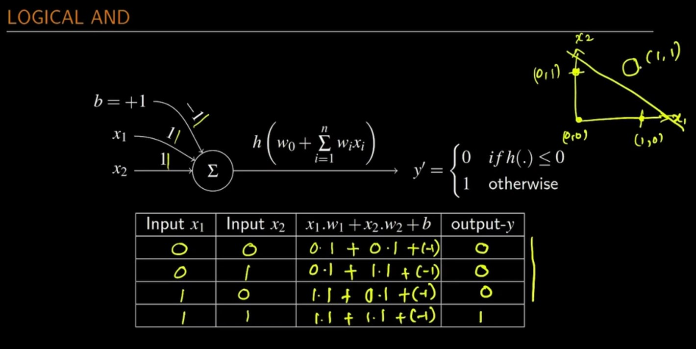

### 5.7.2. Logical OR

- Here for demonstration purpose, below values has been set to:
  - $$b = +1, w_0 = 0$$
  - $$w_1 = +1$$ for $$x_1$$
  - $$w_2 = +1$$ for $$x_2$$
- With above learnt model parameters, it is evident that Perceptron able to classify the linearly separable objects


## 5.8. Sentiment Analysis - Using Perceptron

- Data Source - <https://nlp.stanford.edu/projects/glove>
- For example, to do a +ive/-ive review classification, we need
  - Word Embeddings as Input features
  - Above data source provides word embedding wtih 50, 100, 300, ... vector sizes
  - Ensure that the word that we are taking are present in the word embedding. ONE of the most important thing that we need to do.
  - We need +ive and -view words for training
  


### 5.8.1. Generate Training Data

- Code to generate the training data set


```python
def generate_data():
  #data from https://nlp.stanford.edu/projects/glove/
  #...
  #...
  for pos_word in positives:
    positive_words.append[post_word.rstrip()]

  for neg_word in negatives:
    negative_words.append[neg_word.rstrip()]

  for line in glove:
    values = line.split()
    word = values[0]
    vector = np.asarray(values[1:], dtype='float32')
    if word in positive_words:
      vector = np.append(vector,[1.0])
      emb_dict[word] = vector
    elif word in negative_words:
      vector = np.append(vector, [0.0])
      emb_dict[word] = vector

  #...
  
  dump(emb_dict, data_dir, 'SentiWordEmbedding.bin')
```

### 5.8.2. Build Model


```python
def combine_input_and_weights(self, X):
  # linearly combine input vectors and weight vectors
  return np.dot(X, self.weights)

def build_model(self, X, y):
  # Build a model using the training data X and the class associated with each word embedding
  # X contains the word embeddings of sentiment words
  # y array contains the sentiment lables for every word - positive = 1, negative = 0
  X = self.normalize_feature_values(X)
  self.initialize_weights(X)
  for i in range(self.epochs):
    predicted_output = self.activate_function(self.combine_input_and_weights(X))
    errors = y - predicted_output
    self.weights += (self.eta * X.T.dot(errors))
    # Comput the cost function
    cost_function = (errors ** 2).sum() / 2.0
    self.cost.append(cost_function)
  return self
```

### 5.8.3. Predict Sentiments


```python
def predict(self, X):
  # predict the output corresponding to the input vector X
  X = self.normalize_feature_values(X)
  return np.where(self.activate_function(self.combine_input_and_weights(X)) >= 0.0, 1, 0)

classifier = Perceptron(eta=0.00001, epoch=5000)
classifier.build.model(np.array(X),np.array(y))

test = sent_embedding_dict['terrible']
sentiment = classifier.predict(X_test)
print(sentiment) # 0
```

## 5.9. Perceptron Learning through EPOCH count

- When we do the iteration through the $$epoch$$ count
  - we can find that the _decision boundary_ keep shifting between values
  
  Image 1             |  Image 2
:-------------------------:|:-------------------------:
!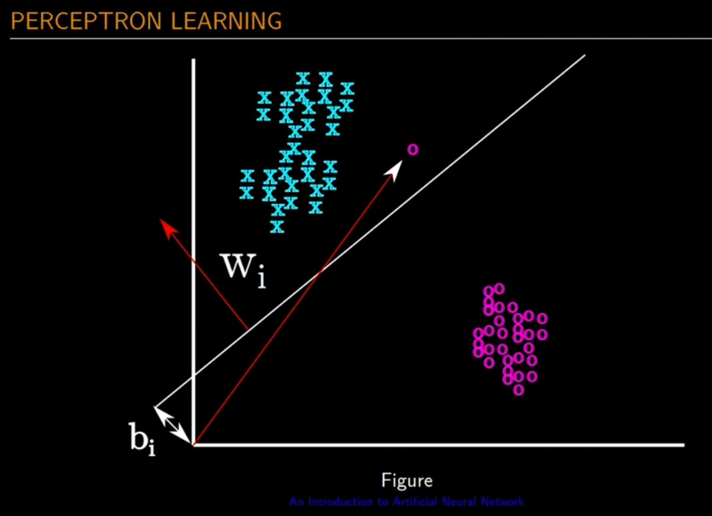  |  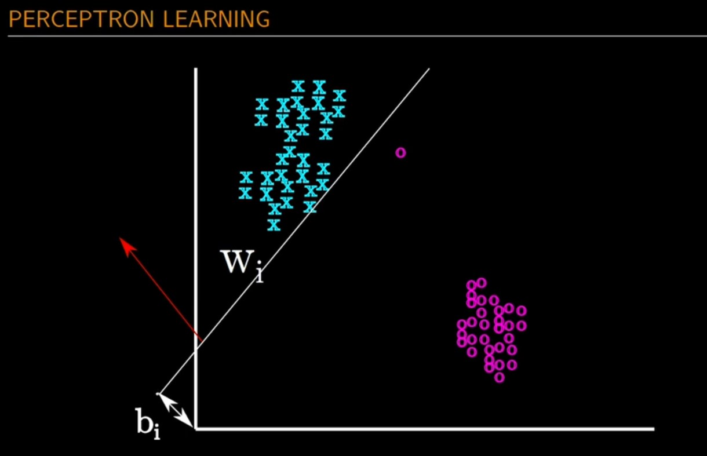
  
## 5.10. Perceptron Limitations

- It is based on the linear combination of fixed basis functions
- Updates the model only based on misclassification
- Documents that are linearly separable are classified

# 6. Activation Functions

- There are several activation functions available
  - Hard threshold
  - Sigmoid (normally used in middle layers)
  - Tanh (normally used in middle layers)
  - ReLu - Rectified Linear Unit
  - Leaky ReLu
  - Softmax (Popular in NLP)

# 7. Logical XOR

- Since Logical XOR data are not linearly separable, it is not possible to solve this problem using _Perceptron_
- How __*Logical XOR*__ can be solved?
  - We need to figure out a way to solve the problems, where
  - The boundaries cannot be a straight line
  - We cannot separate the classes by just a straight line
- In Non-linear cases, we need to increase the hidden units (it depend on the size of the application)

|                   Image 1                  |                   Image 2                  | Image 3                                    |
|:------------------------------------------:|:------------------------------------------:|--------------------------------------------|
|  |  | 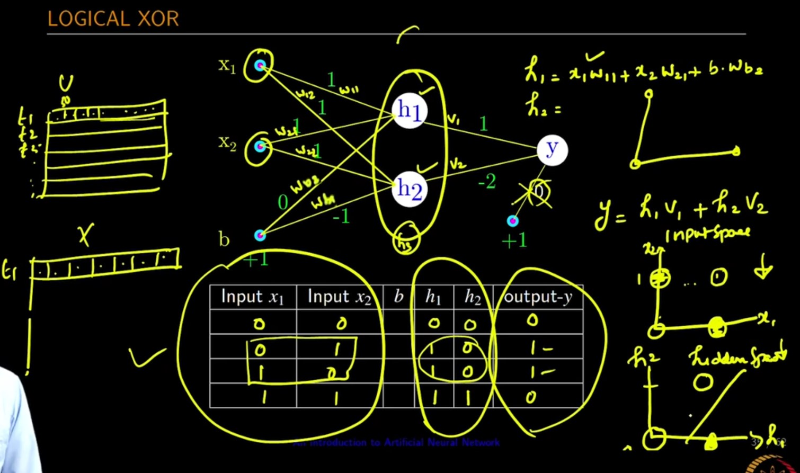 |


## 7.1. Intuition

- Input space is transformed into hidden space
- Hidden layer represents the input layer
- Learns automatically the input representation and patterns
- $$(0,1)$$ and $$(1,0)$$ are merged into one in the $$h$$-space
- Patterns yielding similar results are merged into one
- Dimensionality reduction

## 7.2. Exercise - 1

- Add one more neuron in the hidden layer and compute the output matrix
  - See how values are reshaped in hidden layer and how it impacts the output

## 7.3. Exercise - 2

- Are hidden layer neurons joining piecewise linear representations to create non-linear-boundaries?


```python

```
